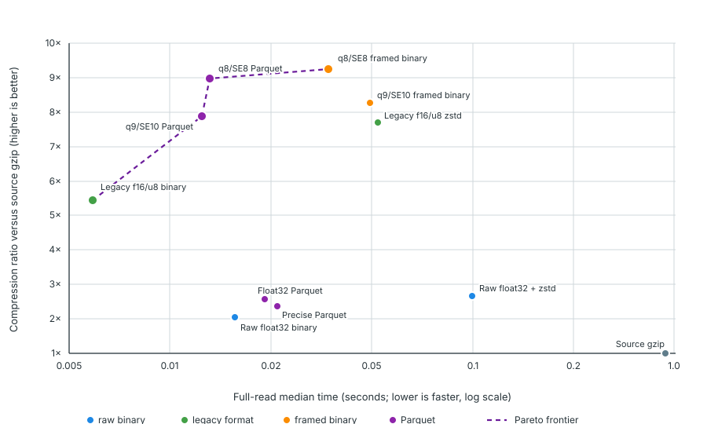

# CompreSSoR

CompreSSoR converts GWAS summary statistics into a compact, reference-anchored store that can be read back as ordinary R data frames.

The standard public store is q9/SE10 Parquet-backed. It keeps the GRCh38 variant spine and study values separate, records the codec and tolerances in a manifest, preserves p-values, and can retain extra columns in sidecars. An optional q8 framed cache is available for repeated regional and MR access.

## External GRCh38 reference

CompreSSoR follows the useful part of the CRAM model: the reference is a
versioned external dependency, not copied into every compressed study. The
default reference descriptor points to the GWASLab 1KG dbSNP151 GRCh38
autosomal variant table. It is downloaded only when first needed into the
per-user CompreSSoR cache, checksum-verified, reused on later runs, and
recorded in the output manifest with its source URL, local path, MD5 and
SHA-256. Raw local reference tables are normalized to a portable Parquet
reference cache on first use; subsequent compressions reuse that cache
automatically. Its location is available from `reference_cache_dir()`, and
the exact cache path is recorded in the store manifest.

Example:

    reference <- grch38_reference()
    resolved <- resolve_reference(reference)
    store <- compress_sumstats(study, "study.cpr", reference = "GRCh38")

The BP pipeline's shared GRCh38 variant dictionary can be used instead by
passing its local TSV/Parquet path or a descriptor with
list(variants = ..., build = "GRCh38"). The package recognizes BP/GWASLab-style
column aliases, aligns alleles to the reference spine, and records the result
per row. The default QC path preserves every input row: unresolved variants
are retained with a `harmonisation_status` of `unmatched`, `incompatible` or
`ambiguous`. Supplying reference = NULL is an explicit escape hatch for
unanchored exploratory data and is recorded as such in the manifest.

## Why this design?

The first direct benchmark used five-run full reads of a real 10-million-row GWAS. Lower speed is better and higher compression is better. The dashed line is the measured Pareto frontier.



The result is not one universal physical winner. Parquet is the portable source of truth; framed binary is a useful serving cache. Users choose a semantic profile rather than having to understand q-codes and frame layouts.

## Benchmarks

The underlying measured values are shipped with the package in
[inst/benchmarks/first-pareto.csv](inst/benchmarks/first-pareto.csv), and can
be read from R with benchmark_table(). The benchmark is a five-run full read
of a real 10-million-row GWAS:

| Format | Median full read (s) | Compression vs source gzip | Pareto |
|---|---:|---:|:---:|
| Source gzip | 0.922 | 1.00× | No |
| Raw float32 binary | 0.0214 | 2.04× | No |
| Raw float32 binary + zstd | 0.1704 | 2.67× | No |
| Current f16/u8 binary | 0.00616 | 5.44× | Yes |
| Current f16/u8 zstd | 0.0744 | 7.71× | No |
| Float32 Parquet | 0.0278 | 2.57× | No |
| Precise Parquet | 0.0308 | 2.37× | No |
| q9 framed binary | 0.0696 | 8.27× | No |
| q9 Parquet | 0.0159 | 7.89× | Yes |
| q8 Parquet | 0.0171 | 8.97× | Yes |
| q8 framed binary | 0.0483 | 9.26× | Yes |

The output store manifest also records this benchmark's ID and measurement
definition. These are design-record measurements, not hardware-independent
performance guarantees.

## Conversion and QC modes

The package has one deliberately conservative default and explicit shortcuts
for workflows that need less checking or a smaller panel:

| Mode | Reference alignment | Variant retention | Intended use |
|---|---|---|---|
| `convert` | None | Every input row | Fastest structural conversion when the caller has already harmonised the data |
| `qc` (default) | GRCh38 spine | Every input row | Normal conversion with allele checks, beta/EAF flips and per-row status |
| `all` | Same as `qc` | Every input row | Readable alias for the default |
| `core` | GRCh38 spine | Rows in the supplied core panel | Ultra-compact analysis panel |
| `hm3` | GRCh38 spine | Rows in the supplied HM3 panel | HapMap3-style compatibility panel |

`core` and `hm3` never silently choose a panel: pass `variant_set` as a
data frame, `.bim`/`.bim.gz`, Parquet or delimited file. Panel filtering is
reported in the manifest. `strict = TRUE` changes QC from row-preserving to
fail-closed, stopping on duplicates or unresolved alignment; it does not
silently discard anything.

```r
# Default: harmonise/QC, but keep all variants, including unresolved ones.
store <- compress_sumstats(study, "study-qc.cpr", reference = grch38_spine)

# Minimal conversion when harmonisation has already happened upstream.
store <- compress_sumstats(study, "study-convert.cpr", mode = "convert",
                           reference = NULL)

# Optional smaller stores, with an explicit panel.
store <- compress_sumstats(study, "study-core.cpr", reference = grch38_spine,
                           mode = "core", variant_set = "core.bim.gz")
```

The shipped mode benchmark used 550,000 balanced synthetic rows across 22
chromosomes and three runs. Median times were 0.374 s for serial QC, 0.956 s
for four-worker chromosome-parallel QC, and 1.130 s for four-worker core
filtering; QC retained all 550,000 rows and core retained its panel's 275,000.
This confirms output parity and the mode accounting, but the small balanced
fixture is too small for parallel startup to pay off. A full real 16.1-million
row preserve-all run also showed that the current in-memory forked path is
memory/imbalance-bound (chromosome 1 dominates), so chromosome parallelism is
available for correctness and medium-sized inputs but is not yet advertised
as a large-GWAS speedup. The next optimization is a streaming chromosome
batch scheduler following the BP process.

## VCF.bgz + Tabix comparison

VCF.bgz plus a Tabix index is the useful coordinate-indexed baseline. We
measured a real 11,106,737-row VCF representation that retained REF/ALT, beta,
SE and p-value, then bgzip-compressed and Tabix-indexed it:

| Representation | Total storage | Ratio vs source gzip | Full read median (s) | 10 Mb region median (s) |
|---|---:|---:|---:|---:|
| VCF.bgz + Tabix | 163,033,211 B | 0.982x | 13.28 | 0.09 |

The five full reads were 12.08, 13.28, 14.05, 13.65 and 12.92 seconds. The
five Tabix regional reads were 0.05, 0.05, 0.09, 0.09 and 0.09 seconds for
40,822 rows. This source was GRCh37 and had 11.1 million rows, so the result
is a separate storage/access comparison rather than a new point on the first
10-million-row Pareto plot. Read the shipped comparison with
benchmark_table("vcf").

## Real non-EBI end-to-end test

The package path was also run on a randomly selected FinnGen R2 endpoint,
ANTIDEPRESSANTS, from the public FinnGen bucket. This is a real GRCh38 GWAS,
not an EBI/GWAS Catalog file. The untouched 391,708,712-byte gzip contained
16,111,549 rows and used BP/GWASLab-style fields such as #chrom, pos, ref,
alt, pval, beta and sebeta. The table below is the historical fixed-panel
benchmark, retained as a storage/performance record; it predates the new
preserve-all default and therefore reports only rows in the BP shared spine.

| Measurement | Result |
|---|---:|
| BP reference rows | 6,271,258 |
| Output rows | 3,294,606 |
| Standard Parquet store | 132,687,271 B |
| Output/input gzip ratio | 0.338575 |
| End-to-end elapsed time | 68.679 s |
| Regional decoded rows | 384 |
| validate_compressor() | TRUE |

The manifest records 33,372 duplicates, 12,302,220 variants absent from the
BP shared dictionary, 20,074 incompatible allele rows and 461,277 unresolved
ambiguous rows. The full measured row-level results are in
inst/benchmarks/finngen-end-to-end.csv and can be read with
benchmark_table("finngen").

A new 100,000-row smoke test of the preserve-all QC path retained and decoded
all 100,000 rows and passed validation; the unmatched, incompatible and
ambiguous counts were 71,330, 288 and 3,224. A full preserve-all conversion
is intentionally not substituted into this historical benchmark until its
streaming implementation is optimized.

### Compression-time optimization

The reference-cache optimization was measured on the same Mac mini and the
same 16,111,549-row input. It preserves the BP coordinate-spine output and
retains 3,294,606 rows in every run:

| Cache state | Runs | Time |
|---|---:|---:|
| Historical raw-reference baseline | 1 | 68.679 s |
| Cold normalized-reference cache | 1 | 77.370 s |
| Warm normalized-reference cache | 5 | 59.081–68.945 s; median 63.820 s |

The warm median is 7.1% faster than the historical baseline. The normalized
reference cache is 142,797,914 B; the resulting standard Parquet store is
132,687,915 B including its manifest. All seven recorded conversions passed
`validate_compressor()`. The run-level data are shipped in
`inst/benchmarks/finngen-end-to-end-optimization.csv` and are available with
`benchmark_table("finngen_optimization")`.

### Release-gate stress test

The current preserve-all implementation was stress-tested on the Mac mini
using the complete real FinnGen file (16,111,549 rows), with all temporary
data on `/Volumes/crucial_x9/CompreSSoR-benchmarks/`:

| Operation | Runs | Median seconds | Output |
|---|---:|---:|---:|
| Convert-only, standard compression | 5 | 46.006 | 892,353,845 B |
| Convert-only, whole-store decompression | 5 | 35.577 | 16,111,549 rows |
| GRCh38 QC, standard compression | 3 | 96.003 | 899,137,039 B |
| GRCh38 QC, whole-store decompression | 3 | 31.353 | 16,111,549 rows |

All stores validated. Five exact 100,000-row round trips were identical;
five standard round trips retained all rows and had a maximum observed beta
error of 0.01137 on that slice. Five direct regional reads had a 0.048-second
median after Arrow predicate pushdown; the q8 cache median was 0.018 seconds.
The full measured rows are shipped in
`inst/benchmarks/release-gate-benchmark.csv` and
`inst/benchmarks/release-gate-followup.csv`.

The real 100,000-row QC slice had medians of 21.244 seconds serial and 18.985
seconds with four chromosome workers, and the serial/parallel canonical
outputs matched exactly. This is evidence for the implementation on this
machine, not a universal performance promise.

## Quick start

```r
library(CompreSSoR)

store <- compress_sumstats(
  input = "study.tsv.gz",
  output = "study.cpr",
  profile = "standard"
)

read_sumstats(store, region = "chr1:1000000-5000000",
              columns = c("variant_id", "beta", "standard_error", "p_value"))

validate_compressor(store)
```

The input is expected to contain, or use recognizable aliases for, chromosome, position, effect allele, other allele, beta and standard error. Effect-allele frequency is retained when supplied and otherwise stored as missing. A p-value is retained when supplied and otherwise derived from beta/SE.

For strict reference alignment, pass a GRCh38 variant spine as a data frame or Parquet/TSV file:

```r
store <- compress_sumstats(
  input = study,
  output = "study.cpr",
  reference = grch38_spine,
  profile = "standard"
)
```

The reference spine is used to check variant identity, normalize alleles and
flip beta/EAF when the input effect allele is reversed. The default preserves
ambiguous, incompatible and unmatched rows and annotates them with
`harmonisation_status`; use `strict = TRUE` when unresolved rows should stop
the conversion.

To inspect the harmonised data before writing a store, call `harmonise_sumstats(study, grch38_spine)`. The same harmonisation step is performed automatically inside `compress_sumstats()`.

## Profiles

| Profile | Intended use | Physical representation |
|---|---|---|
| `standard` | Compact routine analysis | q9 z / SE10 / EAF12 Parquet plus exception sidecars |
| `exact` | Publication, replication and final estimates | Lossless numeric Parquet |
| q8 cache | Repeated MR and regional access | Optional independent q8 frames; not the source of truth |

The package does not make q8 framed binary and q9 Parquet equal user-facing choices. q9 is the standard durable store; q8 is an acceleration layer.

In code, `profile = "standard"` is therefore the default durable contract:
it writes Parquet with the `q9_z_se10_eaf12` codec and does not create a q8
cache unless `cache = TRUE` is requested.

## Fast cache

Build the optional cache with [`build_cache()`](#fast-cache). The on-disk
framing and index are implemented in [`R/cache.R`](R/cache.R):

```r
build_cache(store, overwrite = TRUE)
read_sumstats(store, region = "chr1:1-50000000", use_cache = TRUE)
```

The cache is stored at `study.cpr/cache.q8/` as independently compressed blocks. It is deliberately labelled approximate and is intended for discovery, repeated region scans and MR workloads. Use the standard or exact store for durable results.

## Core functions

- `compress_sumstats()` — write a CompreSSoR store.
- `harmonise_sumstats()` — normalize and align sumstats to GRCh38.
- `grch38_reference()` / `resolve_reference()` — describe and cache the external
  GRCh38 reference.
- `benchmark_table()` — read the shipped measured benchmark data.
- `open_compressor()` — open and inspect the manifest.
- `read_sumstats()` — decode whole stores, regions or selected variants.
- `decompress_sumstats()` — explicit alias for reading decoded values.
- `build_cache()` — write the optional q8 framed cache.
- `validate_compressor()` — check files, manifest and row counts.

## Project status

The package now has a real release-gate suite covering varied delimited and VCF
inputs, allele edge cases, exact/lossy/cache round trips, corruption detection,
regional access, repeated real-GWAS compression/decompression and serial versus
chromosome-parallel QC. It is still intentionally focused on the standalone
summary-statistics conversion layer; fastMR-specific wrappers, build inference/
liftover, streaming chromosome batches and native compiled codecs remain
separate follow-on work rather than hidden assumptions.

## Development and verification

The package is being developed as a standalone GitHub-installable R package.
Heavy integration and performance runs are executed on the Mac mini. Raw
GWAS, references, temporary CompreSSoR stores, caches and logs stay on the
mini's external SSD under `/Volumes/crucial_x9/CompreSSoR-benchmarks/`; only
small benchmark tables, manifests and reports are kept in this project.

The release gate is not just `R CMD check`: it includes alias/format ingestion,
adversarial allele cases, exact and lossy round trips, cache round trips,
regional reads, duplicate and missing-value handling, repeated compression
timings, and stress tests on real GWAS slices. The reproducible commands live
under `scripts/` and write their bulky intermediates to the external path.
