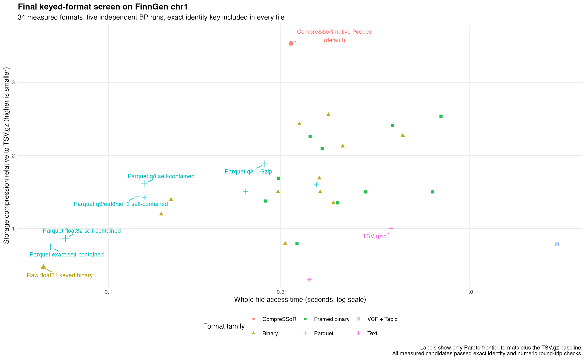

# CompreSSoR

<p align="center">
  
</p>

<p align="center"><strong>Compact, indexed GWAS summary statistics for R.</strong></p>

[](https://github.com/gushamilton/CompreSSoR/actions/workflows/R-CMD-check.yaml)
[](LICENSE)

CompreSSoR converts a GWAS summary-statistics table into a self-contained,
indexed `.cpr` store. The standard store is designed for compact storage and
fast whole-genome, regional, and sparse-variant access from R and `fastMR`.

The normal path is:

```text
sumstats → import → optional GRCh38 liftover/QC → Pcodec .cpr store → read/MR
```


## Why this format?

The store keeps the variant identity in every file, without repeating rsIDs or
requiring a study-specific external spine. It stores the core numerical streams
in Pcodec and derives beta and p-value when requested.

The headline plot below is the final same-data BP benchmark on 1,124,344
FinnGen chr1 SNVs. It measures 34 concrete keyed formats, with five independent
Slurm runs per format. Every candidate stores the exact position plus directed
REF→ALT identity; no external spine is counted. Storage is relative to the
same TSV.gz, so higher is smaller and left is faster.



| Pareto point | Access median | Storage relative to TSV.gz |
|---|---:|---:|
| Raw float64 keyed binary | 0.066 s | 0.47× |
| Parquet exact self-contained | 0.069 s | 0.75× |
| Parquet q8 self-contained | 0.126 s | 1.61× |
| Parquet q8 + Gzip | 0.271 s | 1.88× |
| **CompreSSoR native Pcodec (default)** | **0.321 s** | **3.53×** |
| TSV.gz baseline | 0.607 s | 1.00× |

The standard Pcodec store is the compression-first choice: it is 3.53× smaller
than TSV.gz and its full-file read was 1.9× faster on this BP run. Its measured
conversion median was 12.18 s; conversion is intentionally secondary to repeated
read/access cost. All 34 candidates passed identity and numeric round-trip
validation. The complete 170-observation table, medians, frontier, and measured
/unavailable registry are in [`inst/benchmarks/final-keyed-20260804/`](inst/benchmarks/final-keyed-20260804/).

The final benchmark script is [`scripts/benchmark-final-keyed.R`](scripts/benchmark-final-keyed.R)
and the five-task Slurm wrapper is [`scripts/benchmark-final-keyed.sbatch`](scripts/benchmark-final-keyed.sbatch).
Zarr, Blosc2, Vortex, and Python-only Pcodec bindings were recorded as unavailable
on BP rather than guessed or plotted.

The old one-million-row Mac mini fixture remains available as a historical
engineering record; the current real-data check is run on BP below.

The native-only smoke benchmark on the Mac mini used one million coherent
rows (`Z ~ N(0, 1)`, `beta = Z × SE`) and five warm full reads:

| Native 0.4.4 measure | Result |
|---|---:|
| Store size | **3,067,151 bytes** |
| Write time | **4.347 s** |
| Full read, all columns | **0.058 s** |
| 10 kb region read | **0.008 s** |
| 25 canonical-key read | **0.204 s** |

Each access number is the median of five runs; the canonical-key test requests
100 keys. The store passed full validation and all checksums. This is a
reproducible engineering check for the installed native backend; the older
real-GWAS records predate the native-only format.

The final BP chr1 check uses the same eight-column source (`chrom`, `pos`, `REF`,
`ALT`, `beta`, `SE`, `EAF`, `p`) and five independent full-file access runs:

| Measure | CompreSSoR Pcodec |
|---|---:|
| Store size | **4,298,204 bytes** |
| Conversion median | **12.178 s** |
| Full-file read median | **0.321 s** |

The source TSV.gz is 15,186,281 bytes, so the self-contained store is
**3.53× smaller**. The selected geometry uses 131,072-row identity frames and
Pcodec pages, and 65,536-row value frames. See the [same-data summary](inst/benchmarks/pareto-chr1-summary.csv),
[BP optimization record](inst/benchmarks/bp-finngen-chr1-optimization.csv),
and [reproducible benchmark script](scripts/benchmark-pareto-chr1.R).

See [the detailed benchmark record](inst/benchmarks/cold-mr-final-summary.csv)
for all runs and [the technical guide](docs/README-technical.md) for protocol,
limitations, and historical comparisons.

## Installation

The package is native-only: it builds Pcodec through a small Rust-to-R C ABI,
so ordinary reads and writes do not start another process. Install Rust/Cargo
once, then install CompreSSoR:

```bash
# macOS with Homebrew
brew install rust
```

```r
install.packages("remotes")
remotes::install_github("gushamilton/CompreSSoR")
```

If Cargo is missing or the native library cannot be built, installation stops
with an actionable error. The historical Python-backed implementation is
archived in the repository and is not part of the installed package. See the
[technical guide](docs/README-technical.md#native-pcodec-backend) for the
format and build details.

## Quick start

For an already verified GRCh38 REF/ALT table:

```r
library(CompreSSoR)

store <- compress_sumstats(
  "gwas.tsv.gz",
  "gwas.cpr",
  mode = "convert",
  reference = NULL,
  assume_grch38_ref_alt = TRUE,
  overwrite = TRUE
)

validate_compressor(store, full = TRUE)
read_sumstats(
  store,
  columns = c("chromosome", "base_pair_location", "beta", "standard_error")
)
```

For an ordinary third-party GWAS, use the QC path and a configured GRCh38
reference. A GRCh37 input also needs a liftover chain:

```r
store <- compress_sumstats(
  "gwas.tsv.gz",
  "gwas.cpr",
  input_build = "GRCh37",
  chain = "/data/reference/hg19ToHg38.over.chain.gz",
  reference = "GRCh38",
  mode = "qc",
  chrom_threads = 4,
  overwrite = TRUE
)
```

The reference is used during ingestion to establish GRCh38 identity and
allele orientation. The completed standard `.cpr` store carries its own
identity and does not need the reference beside it for reading.

### Optional BP-style variant panels

The default is to keep every valid input variant. To apply a BP common- or
tag-variant panel, pass `variant_set = "common"` or `variant_set = "tag"` and
point the corresponding environment variable at a small compressed panel:

```r
Sys.setenv(COMPRESSOR_COMMON_VARIANTS = "/data/panels/common.parquet")
store <- compress_sumstats(
  "gwas.tsv.gz", "gwas-common.cpr", mode = "convert", reference = NULL,
  assume_grch38_ref_alt = TRUE, variant_set = "common", overwrite = TRUE
)
```

Panels may be Parquet, delimited text, PLINK `.bim`, or a CompreSSoR Pcodec
store. They need either the canonical `variant_id` (`chrom:pos:REF:ALT`) or
`chromosome`, `base_pair_location`, `other_allele` (REF), and `effect_allele`
(ALT). The panel is only a membership filter against the identity key already
stored in each GWAS; it is not a shared spine and is not included in the GWAS
store size. `variant_set = NULL` leaves the main pathway unchanged. The same
flag works with `harmonise_sumstats()` and with `mode = "convert"`, where no
reference harmonisation is performed.

## Reading and FastMR

```r
region <- read_sumstats(
  store,
  region = "chr1:100000000-101000000",
  columns = c("chromosome", "base_pair_location", "beta", "standard_error")
)

instruments <- c("1:109274968:A:G", "6:160589086:C:T")
sparse <- read_sumstats(
  store,
  variants = instruments,
  columns = c("beta", "standard_error")
)
```

For independent block or canonical-key reads, set `threads` to run several
Pcodec readers concurrently on Unix-like systems. This is most useful when a
request spans many blocks or when reading the same instruments from several
GWAS files; the default remains serial and Windows falls back to serial reads:

```r
hits <- read_sumstats(
  store, variants = instruments,
  columns = c("beta", "standard_error"), threads = 4
)

grid <- read_sumstats_batch(
  c(exposure = "exposure.cpr", outcome = "outcome.cpr"),
  variants = instruments,
  columns = c("beta", "standard_error"), threads = 4
)
```

The parallel path uses independent R worker processes, each decoding private
Pcodec blocks; it does not change the file format or decoded values.

`fastMR` can read the requested canonical keys directly from `.cpr` stores and
send the matched beta/SE matrices into its compiled estimator:

```r
remotes::install_github("gushamilton/fastMR")

result <- fastMR::fast_mr_compressed(
  exposure_files = c(exposure = "exposure.cpr"),
  outcome_files = c(outcome = "outcome.cpr"),
  instruments = instruments,
  methods = "ivw"
)
```

The direct path does not load a whole GWAS or reconstruct p-values. It reads
each exposure for its own instruments, reads each outcome for the union, and
uses the shared matrix-grid estimator where possible.

## What is stored?


Every native 0.4 `.cpr` is a directory with a manifest, checksums,
independently framed Pcodec streams, and a compact exception stream:

```text
gwas.cpr/
├── manifest.json          format, identity, codec, source, and QC metadata
├── manifest.sha256        detached manifest checksum
├── position.pco           global GRCh38 positions
├── native.index.json      block offsets and row counts
├── substitution.pco       four-bit REF→ALT substitution code
├── z.pco                   quantised Z stream
├── eaf.pco                 arcsine-quantised effect-allele frequency
├── se.pco                  block-centred log2-quantised SE stream
└── exceptions.bin          sparse higher-precision numeric exceptions
```

The native 0.4.4 store uses 131,072-row identity frames, 131,072-row Pcodec
pages, and 65,536-row numeric access frames by default; `block_rows` changes
the numeric frame size when a smaller random-access frame is preferable. Older
0.2/0.3 stores belong to
the archived pre-native implementation and are not read by this release.

| Logical field | Standard storage | Read-time result |
|---|---|---|
| Chromosome + position | GRCh38 global position, Pcodec `uint32` | Exact chromosome and position |
| REF + ALT | Complete four-bit substitution code | Exact alleles |
| Z | 9-bit semantic code, Pcodec stream | Quantised Z, with exceptions |
| EAF | 8-bit arcsine code, Pcodec stream | Quantised EAF |
| SE | 8-bit block-centred log2 residual | Quantised SE, with exceptions |
| Beta | Not stored per row | Derived as `Z × SE` |
| p-value | Not stored | Derived from Z |
| rsID/text variant ID | Not stored | Use `chrom:pos:REF:ALT` |

Identity is lossless. Standard numeric values are deliberately bounded-lossy;
the manifest records the profile and tolerances. Use the exact Parquet backend
when bitwise-exact doubles or arbitrary non-core fields are required.

### Optional extra columns

The standard Pcodec payload intentionally contains only the core fields above.
This keeps routine MR stores small and predictable. The current released
fallback for retaining arbitrary row-wise columns is:

```r
compress_sumstats(
  input, output,
  backend = "parquet",
  keep_extras = TRUE,
  profile = "exact"
)
```

Those extras are stored as an interoperable Parquet sidecar keyed by the
canonical row number. Pcodec itself can losslessly compress separate numeric
streams, so a typed Pcodec extras layer is feasible; it is not yet part of the
standard `.cpr` contract. We keep that distinction explicit rather than
silently putting arbitrary strings or mixed R columns into a numerical codec.
The design and next implementation step are documented in
[the technical guide](docs/README-technical.md#optional-extra-columns).

## Benchmarks at a glance

Five randomized cold-cache repetitions on the Mac mini, with fresh R
processes and distinct fresh copies for each logical study:

| Input path | 1×1 MR | 5×5 MR | 25×25 MR |
|---|---:|---:|---:|
| **CompreSSoR + FastMR direct** | **0.264 s** | **0.479 s** | **1.274 s** |
| CompreSSoR, explicit reads | 0.387 s | 1.581 s | 7.624 s |
| VCF.gz + Tabix | 0.085 s | 0.330 s | 1.537 s |
| TSV.gz full scans | 6.747 s | 32.830 s | 165.266 s |

Tabix is best for one or a few sparse queries. Direct Pcodec crosses over at
the 25×25 workload. Full-load medians were 3.182 s for Pcodec, 3.954 s for
TSV.gz, and 10.163 s for VCF.gz.

## Further documentation

- [Technical guide, design questions, and full benchmark protocol](docs/README-technical.md)
- [Machine-readable benchmark summary](inst/benchmarks/cold-mr-final-summary.csv)
- [All 75 benchmark repetitions](inst/benchmarks/cold-mr-final-runs.csv)
- [Benchmark metadata and parity gates](inst/benchmarks/cold-mr-final-metadata.json)
- [FastMR direct compressed-MR package](https://github.com/gushamilton/fastMR)

## Verification

```bash
Rscript -e 'testthat::test_local(".")'
R CMD check . --no-manual --as-cran
```

Large GWAS files, reference tables, benchmark stores, and temporary bridges
remain outside the repository. The committed benchmark CSV/JSON/Markdown
files are the durable evidence.

## License

MIT
