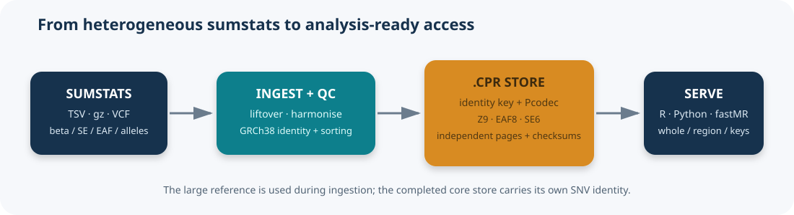
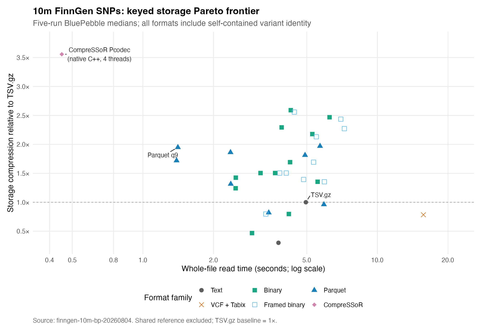
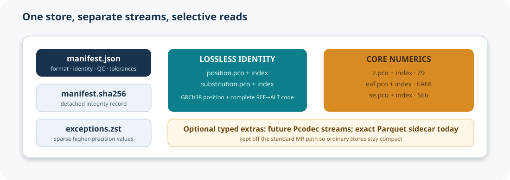

# CompreSSoR

<p align="center">
  
</p>

<p align="center"><strong>Compact, indexed GWAS summary statistics for R.</strong></p>

[](https://github.com/gushamilton/CompreSSoR/actions/workflows/R-CMD-check.yaml)
[](LICENSE)

CompreSSoR converts already-prepared GWAS summary statistics into a
self-contained, indexed `.cpr` store for compact storage and fast whole-file,
regional, and variant-level access from R. The core path is:

```text
prepared sumstats → strict schema/orientation QC → native Pcodec .cpr store
```



## Main result

The current headline comparison is the latest five-run BluePebble benchmark
on 10 million real FinnGen SNPs. Every candidate stores its own exact variant
identity key; no external reference is required by the resulting store.

The locked storage contract is documented in
[`docs/pcodec-final-spec.md`](docs/pcodec-final-spec.md).

| Format | Size | Whole-file read |
|---|---:|---:|
| **CompreSSoR native Pcodec, 4 threads** | **38.06 MB** | **0.451 s** |
| Parquet q9 | 69.48 MB | 1.410 s |
| TSV.gz | 135.39 MB | 4.955 s |

The Pcodec store is 3.56× smaller than TSV.gz. The authoritative records and
the archive policy are in [`benchmarks/`](benchmarks/README.md); older plots
and benchmark families are under
[`inst/benchmarks/archive/legacy-20260804/`](inst/benchmarks/archive/legacy-20260804/).

The separate large-file memory evidence for a 23.7-million-row UKB-PPP NTRK3
protein, including its exact access contract, external storage policy,
phase-level timings, and bounded-RSS results, is recorded in the
[`issue #27 benchmark section`](benchmarks/README.md#issue-27-bounded-memory-evidence).



## What is stored?



The standard `.cpr` directory contains a manifest, checksums, an exact
variant-identity stream, independently framed numerical streams, and sparse
exceptions:

```text
gwas.cpr/
├── manifest.json          format, identity, codec, source, and QC metadata
├── manifest.sha256        detached manifest checksum
├── position.pco           compact build-specific global position stream
├── native.index.json      block offsets and row counts
├── substitution.pco      four-bit REF→ALT identity code
├── z.pco                  quantised Z stream
├── eaf.pco                arcsine-quantised EAF stream
├── se.pco                 block-centred log2-quantised SE stream
└── exceptions.bin         sparse higher-precision numeric exceptions
```

The identity key is stored in every GWAS, so an external variant spine is not
required for access or comparison. The standard numerical representation is:

| Logical field | Stored representation | Read-time result |
|---|---|---|
| Chromosome + position | GRCh37 or GRCh38 global position | Exact chromosome and position |
| REF + ALT | Four-bit directed substitution code | Exact alleles |
| Z | 9-bit semantic code plus exceptions | Quantised Z |
| EAF | 8-bit arcsine code | Quantised EAF |
| SE | 6-bit semantic block-centred log2 residual in a physical `uint8` stream | Quantised SE |
| Beta | Not stored per row | Derived as `Z × SE` |
| p-value | Not stored | Derived from Z |
| rsID/text ID | Not stored | Use `chrom:pos:REF:ALT` |

This is intentionally a core numerical format. Exact or arbitrary extra
columns can use the Parquet backend; see
[the technical guide](docs/README-technical.md).

### Bundled core/HM3 variant panel

The package also bundles one compact native Pcodec panel at
`inst/extdata/panels/core_hm3.cpr`. It is one canonical, sorted GRCh38 list of
6,271,256 frozen core variants. Core membership is implicit by row membership;
the only additional logical column is the lossless `hm3` flag (`1`/`0`). The
bundled store is 11,081,115 bytes across its payload, index, manifest, and
checksum files. It is not a reference genome, harmonisation resource, or
liftover chain.

The bundled panel is used automatically by `selection = "core"` and
`selection = "hm3"` without environment variables. `read_variant_panel()`
provides panel access, while `read_variant_set("core")` and
`read_variant_set("hm3")` preserve the existing selection API. The panel
contains 1,199,729 HM3-positive rows within the core universe; 13,236 rows in
the HM3 source fall outside that universe and therefore have no row in the
combined panel.

`selection = "core_plus"` retains the core panel plus the row-wise union of
inclusive 10,000-bp windows on either side of rows with `p <= 1e-5`. The
threshold and window are explicit `pvalue_threshold` and `region_padding`
arguments and are recorded in the manifest; 50-kb or other windows remain
available only when requested explicitly. A finite supplied p-value is
authoritative; missing or invalid values are counted and fall back to the
exact prepared pre-encoding Z (`beta / standard_error` when Z is absent).
Selection never uses a lossy decoded value, and p-values are not stored in the
native payload.

The statistic policy depends deliberately on the QC mode. In the default
`qc = "compact"` path, malformed, non-finite, or out-of-range supplied
p-values are rejected before core-plus selection; the rejection counts are
recorded in both structural-QC provenance and the selection manifest, so they
are not silently rescued by Z. In the trusted `qc = "none"` path, numeric QC
is bypassed and missing or invalid supplied p-values may use the exact
pre-encoding-Z fallback; supplied, derived, fallback, missing, unresolved, and
pre-selection QC counts are recorded in the manifest and region sidecar.

The frozen source hashes and exact output layout are documented in
[`docs/variant-panels.md`](docs/variant-panels.md).

## Install

The native backend builds Pcodec through a small Rust-to-R C ABI. Install Rust
once, then install the package:

```bash
# macOS with Homebrew
brew install rust
```

```r
install.packages("remotes")
remotes::install_github("gushamilton/CompreSSoR")
```

### BluePebble native Pcodec setup

The native backend requires Rust/Cargo **>= 1.87.0**, as pinned by
[`src/pcodec_native/Cargo.toml`](src/pcodec_native/Cargo.toml). On BluePebble,
run setup in an interactive or login shell so the module environment is
available. Inspect the current catalogue on the day of the run; module names
and project-local toolchain paths are not stable:

```bash
bash -lic 'module purge; module load languages/R/4.5.1; module spider rust 2>&1'
```

The established BP jobs load `rust/1.78.0-n5bm` for the Cargo environment and
then prepend the project-local pinned Rust 1.87 toolchain to both executable
and shared-library lookup. Substitute the current, verified project path; do
not copy a stale path from an old job:

```bash
module purge
module load languages/R/4.5.1
module load rust/1.78.0-n5bm       # verify this is still the available module
rust_root=/path/to/project-local/rust-1.87.0/rustc  # verify on the day
export PATH="$rust_root/bin:$PATH"
export LD_LIBRARY_PATH="$rust_root/lib${LD_LIBRARY_PATH:+:$LD_LIBRARY_PATH}"

command -v cargo
command -v rustc
rustc --version
cargo --version
```

Stop if `rustc` or `cargo` reports a version below 1.87.0; there is no
supported generic fallback backend for the native benchmark. Set isolated
`R_LIBS` and `R_LIBS_USER` paths, then install only after the toolchain check:

```bash
export R_LIBS=/path/to/external/CompreSSoR-benchmark/Rlib
export R_LIBS_USER="$R_LIBS"
R CMD INSTALL --library="$R_LIBS" /path/to/CompreSSoR-checkout
```

The canonical large-file example is
[`scripts/benchmark_issue27_ntrk3.sbatch`](scripts/benchmark_issue27_ntrk3.sbatch),
which accepts `COMPRESSOR_ISSUE27_RUST_MODULE` and
`COMPRESSOR_ISSUE27_RUST_ROOT`, verifies the compiler, and records the exact
toolchain in the external Slurm log. If Cargo or native installation fails,
do not claim a benchmark. Keep raw inputs, stores, logs, and results outside
the synced repository.

The historical Python backend is archived and is not part of the installed
package.

## Quick start

The installed compressor accepts a prepared table only. It must contain:
`chromosome`, `base_pair_location`, explicit `reference_allele`/`REF`,
explicit `alternate_allele`/`ALT`, `effect_allele`, `other_allele`, `beta`,
and `standard_error`/`SE`, or a positive `OR`/`odds_ratio` plus `SE` that is
resolved to log-OR. The prepared orientation is `other_allele = REF`
and `effect_allele = ALT`; the compressor never flips alleles or resolves an
ID against a reference. Input and store builds must match, and both GRCh37
(`hg19`) and GRCh38 (`hg38`) are supported:

```r
library(CompreSSoR)

store <- compress_sumstats(
  "gwas.tsv.gz", "gwas.cpr",
  input_build = "GRCh38", store_build = "GRCh38",
  threads = 4,
  overwrite = TRUE
)

validate_compressor(store, full = TRUE)
read_sumstats(
  store,
  columns = c("chromosome", "base_pair_location", "beta", "standard_error")
)
```

The boundary importer recognises common aliases through a deterministic
resolution matrix: explicit beta plus `SE` is the primary route; an `OR` plus
`SE` is also accepted directly and resolves beta to log-OR when beta is absent;
an optional `Z` is checked against `beta / SE` or derived from it. P-values
are not silently converted to SE in the strict writer. The standalone
`import_sumstats(..., allow_p_to_se = TRUE)` opt-in is conflict-checked and
records its bounded conversion rows in resolution provenance; it is not used
by `compress_sumstats()`.

For delimited-file input, the native Pcodec path discovers the header first and
projects only columns that can affect the strict identity/statistical core
before canonicalisation and QC. The complete source header and read-column
counts remain in provenance. Parquet with `keep_extras = TRUE` intentionally
reads and retains the full input table; use that mode when arbitrary source
columns are required.

Native and default compression manifests retain aggregate structural-QC counts,
bounded row examples, source/projection provenance, and phase timings for read,
normalisation, QC, identity/sort, encoding, and the final atomic commit. Full
row-level QC status and canonical-key audits remain available through the
explicit `preflight_sumstats()` path rather than being retained through a
large compression job.

For a prepared GRCh37 table, write a native GRCh37 store directly:

```r
store <- compress_sumstats(
  "gwas.tsv.gz", "gwas.cpr",
  input_build = "hg19", store_build = "GRCh37",
  threads = 4,
  overwrite = TRUE
)
```

### Two compression modes

The default `qc = "compact"` path applies structural QC, rejects or reports
invalid rows according to `row_policy`, removes duplicate identity keys, and
records aggregate QC counts. It carries one numeric identity through panel
matching and native encoding rather than repeatedly constructing character
variant IDs.

For a file already prepared into the exact canonical columns, `qc = "none"`
is an explicit fast path:

```r
store <- compress_sumstats(
  "prepared.tsv.gz", "prepared.cpr",
  qc = "none", selection = "core", threads = 4,
  input_build = "GRCh38", store_build = "GRCh38",
  overwrite = TRUE
)
```

This bypasses structural QC, duplicate scans, row-level reports, alias
resolution, and temporary variant-ID construction. It still requires the
canonical `chromosome`, `base_pair_location`, `reference_allele`,
`alternate_allele`, `effect_allele`, `other_allele`, `beta`, and
`standard_error` columns. Before canonicalization, a cheap native-identity
safety filter drops rows with an invalid primary chromosome, non-finite,
non-integer, or out-of-range coordinate, or an invalid/non-distinct A/C/G/T
REF/ALT pair. It does not run full structural QC or duplicate scans; malformed
canonical statistics are not scanned in this trusted fast path, and native
duplicate checks still apply at write time. Dropped identity counts and the pre-filter input count
are retained in the preparation manifest so selection counts remain aligned.
The manifest records `qc$mode = "none"`,
`qc$structural_qc = "bypassed"`, and
`qc$statistic_validation = "bypassed"`. Use this mode only for trusted,
already-oriented input; it does not harmonise, liftover, repair rows, or
validate their numerical values.

`input_build = "GRCh37", store_build = "GRCh38"` is rejected. Perform any
liftover, reference lookup, allele alignment, rsID resolution, and source-file
specific field mapping in an upstream preparation workflow, then pass its
explicit result to CompreSSoR.

### External preparation and archived workflows

The former reference-backed harmonisation and liftover implementation is kept
under [`archive/harmonisation/`](archive/harmonisation/). It is not sourced by
the installed package and is retained only as a migration reference. An
external adapter—such as a GWASLab/MR-Atlas preparation step—should record its
own reference, chain, QC, and timing provenance before calling the strict core.
Panel selection (`core`, `hm3`, and `core_plus`) remains available after the
strict contract has been satisfied; it is filtering, not harmonisation.

## Reading and FastMR

```r
region <- read_sumstats(
  "gwas.cpr",
  region = "chr1:100000000-101000000",
  columns = c("chromosome", "base_pair_location", "beta", "standard_error")
)

instruments <- c("1:109274968:A:G", "6:160589086:C:T")
sparse <- read_sumstats(
  "gwas.cpr", variants = instruments,
  columns = c("beta", "standard_error"), threads = 4
)
```

The companion [fastMR](https://github.com/gushamilton/fastMR) package can use
the same canonical keys to read only the required exposure/outcome values.

## Further documentation

- [Benchmark write-up and reproducible records](benchmarks/README.md)
- [Technical guide and format details](docs/README-technical.md)
- [R package reference](https://gushamilton.github.io/CompreSSoR/)

## Verification

```bash
Rscript -e 'testthat::test_local(".")'
R CMD check . --no-manual --as-cran
```

Large GWAS files, reference tables, benchmark stores, and temporary bridges
remain outside the repository. The committed CSV/JSON/Markdown records are
the durable evidence.

## License

MIT
